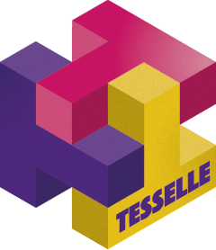

<!-- README.md is generated from README.Rmd. Please edit that file -->

# tesselle 

<!-- badges: start -->

[](https://github.com/tesselle/tesselle/actions)
[](https://app.codecov.io/gh/tesselle/tesselle)
[](https://www.codefactor.io/repository/github/tesselle/tesselle/overview/main)
[](https://cran.r-project.org/package=tesselle)

<a href="https://tesselle.r-universe.dev/tesselle"
class="pkgdown-devel"></a>
<a href="https://cran.r-project.org/package=tesselle"
class="pkgdown-release"></a> <a
href="https://cran.r-project.org/web/checks/check_results_tesselle.html"
class="pkgdown-release"></a>
<a href="https://cran.r-project.org/package=tesselle"
class="pkgdown-release"></a>

[](https://www.repostatus.org/#active)

[](https://doi.org/10.5281/zenodo.6500491)
<!-- badges: end -->

## Overview

The [tesselle](https://www.tesselle.org/) suite is a collection of
packages for research and teaching in archaeology. These packages focus
on quantitative analysis methods developed for archaeology. The tesselle
packages are designed to work seamlessly together and to complement
general-purpose and other specialized statistical packages. These
packages can be used to explore and analyze common data types in
archaeology: [count data](https://packages.tesselle.org/tabula/),
[compositional data](https://packages.tesselle.org/nexus/) and
[chronological data](https://packages.tesselle.org/kairos/).

The **tesselle** package is designed to make it easy to install and load
key packages from the tesselle suite in a single step.

------------------------------------------------------------------------

To cite tesselle in publications use:

Frerebeau N (2024). “The tesselle Project: a Collection of R Packages
for Research and Teaching in Archaeology.” *Advances in Archaeological
Practice*. <doi:10.1017/aap.2024.10>
<https://doi.org/10.1017/aap.2024.10>.

Frerebeau N (2024). *tesselle: Easily Install and Load ‘tesselle’
Packages*. Université Bordeaux Montaigne, Pessac, France.
<doi:10.5281/zenodo.6500491> <https://doi.org/10.5281/zenodo.6500491>, R
package version 1.5.0, <https://packages.tesselle.org/tesselle/>.

This package is a part of the tesselle project
<https://www.tesselle.org>.

## Installation

You can install the released version of **tesselle** from
[CRAN](https://CRAN.R-project.org) with:

``` r
install.packages("tesselle")
```

And the development version from [GitHub](https://github.com/) with:

``` r
# install.packages("remotes")
remotes::install_github("tesselle/tesselle")
```

## Usage

`library(tesselle)` will load the core packages:

- [**tabula**](https://packages.tesselle.org/tabula/): analysis and
  visualization of archaeological count data;
- [**kairos**](https://packages.tesselle.org/kairos/): analysis of
  chronological patterns from archaeological count data;
- [**nexus**](https://packages.tesselle.org/nexus/): analysis of
  compositional data;

And two companion packages:

- [**dimensio**](https://packages.tesselle.org/dimensio/): multivariate
  analysis;
- [**isopleuros**](https://packages.tesselle.org/isopleuros/): ternary
  plots.

``` r
library(tesselle)
#> --- Attaching packages -------------------------------------- tesselle 1.5.0 ---
#> * dimensio    0.10.1
#> * isopleuros  1.3.0
#> * kairos      2.2.0
#> * nexus       0.3.0
#> * tabula      3.1.1
```

## Contributing

Please note that the **tesselle** project is released with a
[Contributor Code of Conduct](https://www.tesselle.org/conduct.html). By
contributing to this project, you agree to abide by its terms.
